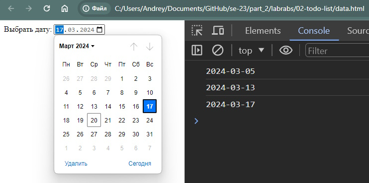

# Labrab-02

## node.js + express  

### ToDo List  

Разработать **API** для хранения списка дел (без напоминания)  

> список дел хранится в виде записей в json-файле  

Каждая запись содержит:  

- id записи (она генерируется автоматически программой)  
- название мероприятия  
- описание мероприятия  
- дата  
- время начала  
- статус (предстоит, выполнено, просрочено)  
- приоритет (важное, обычное, можно не делать)  

> поля могут быть пустыми  
> кроме поля "Название мероприятия"  

---  

Разработать такой функционал:  

- создать новую задачу  
- изменить содержание задачи  
- удалить задачу  
- просмотреть список задач  
- просмотреть список задач по фильтру  
  - за дату (внутри даты с сортировкой по приоритету)  
  - по статусу

---  

Тестировать приложение можете через:  

- VSCode + расширение **Thunder Client**  
- отдельное приложение **PostMan**  

---  

##### 1 Создание новой задачи  

- через post-запрос  
- поля передаются через request.body  
- поле id не надо передавать  

##### 2 изменить задачу  

- через patch-запрос  

##### 3 удалить задачу  

- через delete-запрос  

##### 4 просмотреть список задач  

- через get-запрос  

##### 5 просмотреть список задач по фильтру  

- тоже через get-запрос, только маршрут другой  
- например: `/filter?data=2024-03-17`  

---  

**Обратите внимание**  

Как правильно сравнивать даты в нативном js  
примеры все в программе [`test.js`](./test.js)  

Но в текстовый файл json всё равно записывается дата просто в строковом виде.  
Общепринятый формат даты **ISO 8601**. Пример представления даты в таком формате:  
`2024-03-17T12:00:00.000Z`  
Вы можете пока просто хранить так:  
`2024-03-17`  

Только нужно следить за тем, чтобы год всегда записывался 4-мя цифрами, месяц и дата всегда двумя (03, не 3). Иначе при сортировке будет некорректный результат.  

Впоследствии, в лабораторке с html-формами, дату пользователь будет вводить не вручную строкой `2024-03-17`, а с компонента web-формы приложения `<input type=”date”>`.  

  

--- 
